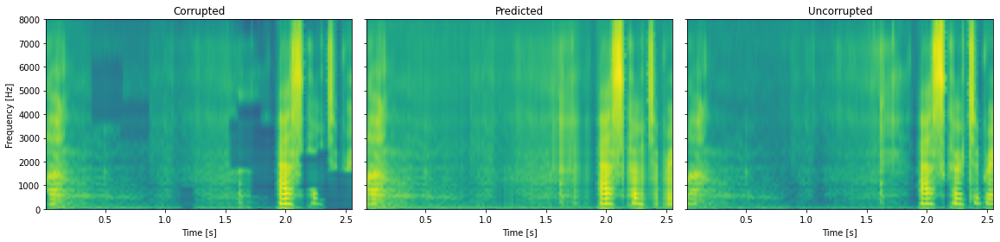

# Deep Speech Inpainting
> This repository contains our best attempt at implementing an algorithm for speech spectrogram reconstruction based on a simple neural network.

## Introduction
Speech signals are often subject to interference, both in the time and frequency domains. These can be caused by transmission interference, poor recording conditions and others. Authors Lars Thieling and Peter Jax propose a solution [[1]](#1). We attempt to replicate their results. 

## Dataset
The data used to train the network is from [[2]](#2). For training purposes, a corruption algorithm was written to insert holes in the bandwidth of the speech signal to simulate the loss of signal information due to interference. The location and size of the holes were chosen randomly so that their overall proportion in the signal bandwidth is about 30%.

## Results
An example of how the algorithm works is presented below. 

## References
<a id="1">[1]</a>
L. Thieling and P. Jax, "Generally Applicable Deep Speech Inpainting Using the Example of Bandwidth Extension," 2021 29th European Signal Processing Conference (EUSIPCO), 2021, pp. 451-455, doi: 10.23919/EUSIPCO54536.2021.9616099.

<a id="2">[2]</a>
Veaux, Christophe; Yamagishi, Junichi; MacDonald, Kirsten. (2017). CSTR VCTK Corpus: English Multi-speaker Corpus for CSTR Voice Cloning Toolkit, [sound]. University of Edinburgh. The Centre for Speech Technology Research (CSTR). [https://doi.org/10.7488/ds/1994](https://doi.org/10.7488/ds/1994).