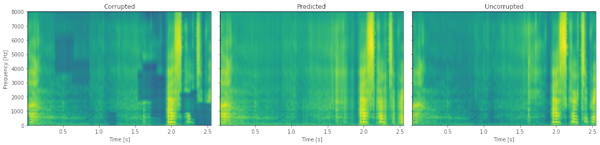

# Deep Speech Inpainting
> This repository contains our best attempt at implementing an algorithm for speech spectrogram reconstruction based on a simple neural network.

## Introduction
Speech signals are often subject to interference, both in the time and frequency domains. These can be caused by transmission interference, poor recording conditions and others. Authors Lars Thieling and Peter Jax propose a solution [[1]](#1). We attempt to replicate their results. 

## Dataset
The data used to train the network is from [[2]](#2). For training purposes, a corruption algorithm was written to insert holes in the bandwidth of the speech signal to simulate the loss of signal information due to interference. The location and size of the holes were chosen randomly so that their overall proportion in the signal bandwidth is about 30%.

## Results

STOI - Short-Time Objective Intelligibility - Correlation measure in the range <0, 1> - the higher the score, the more similar signals are

PESQ - Perceptual Evaluation of Speech Quality - Measure used to assess the perceptual quality of a signal - the higher the score, the more similar signals are

LSD - Log-Spectral Distance - Measure of the distance between spectrograms expressed in dB - the smaller the score, the more similar the signals are

 Measure | STOI | PESQ | LSD
 --- | --- | --- | --- 
Predicted mean |	0.73 | 1.42 | 2.04
Predicted stdev | 0.07 | 0.21 | 0.19
Corrupted mean | 0.66 | 1.23 | 2.56
Corrupted stdev | 0.09 | 0.11 | 0.27

The network is definitely improving its performance, however it is still not at a satisfactory level.

An example of how the algorithm works is presented below. 

## Conculsions
Results are not as great as expected. In this case MFCC as features extraction method is bottleneck for our system. This is because MFCC extracts the most important information for speech analysis and by definition loses data. It is not possible to invert MFCC and receive listenable audio. If the system were trained on spectrograms (which requires more computing resources) compression (MFCC inversion) could be avoided and the results would be better.

## Technologies
- tensorflow
- librosa
- scipy
- numpy
- matplotlib
- soundfile
- pystoi
- pesq
- zipfile
- requests

## References
<a id="1">[1]</a>
L. Thieling and P. Jax, "Generally Applicable Deep Speech Inpainting Using the Example of Bandwidth Extension," 2021 29th European Signal Processing Conference (EUSIPCO), 2021, pp. 451-455, doi: 10.23919/EUSIPCO54536.2021.9616099.

<a id="2">[2]</a>
Veaux, Christophe; Yamagishi, Junichi; MacDonald, Kirsten. (2017). CSTR VCTK Corpus: English Multi-speaker Corpus for CSTR Voice Cloning Toolkit, [sound]. University of Edinburgh. The Centre for Speech Technology Research (CSTR). [https://doi.org/10.7488/ds/1994](https://doi.org/10.7488/ds/1994).